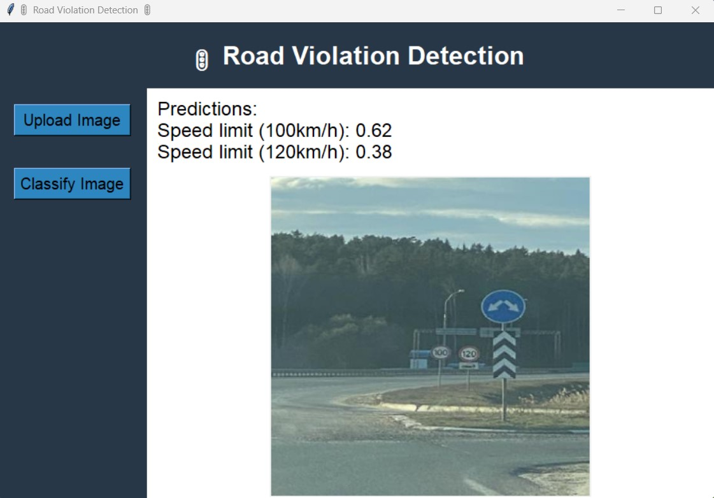

# 🚦Road Violation Detection🚦

## Objectif
Construire un modèle d’apprentissage pour détecter les infractions (violations) au code de la route ciblant spécifiquement les feux de circulations et les panneaux (par exemple feux rouges, panneaux STOP, etc.).  
Ce projet inclut une interface graphique permettant de tester différentes images pour évaluer la pertinence du système.



---

## Base de Données
**DataSet = https://drive.google.com/drive/folders/1_84ouwGTOg_nGTroiM7brgEZVby8QU7l**  
**Classes cibles:**  
- Green Light  
- Red Light  
- Speed Limit 10  
- Speed Limit 20  
- Speed Limit 30  
- Speed Limit 40  
- Speed Limit 50  
- Speed Limit 60  
- Speed Limit 70  
- Speed Limit 80  
- Speed Limit 90  
- Speed Limit 100  
- Speed Limit 110  
- Speed Limit 120  
- Stop  

Les étiquettes des données sont en format **Darknet**.

---

## Étapes du Projet

### Étape 1: Définition de l’architecture du modèle CNN
- Conception d'un modèle de réseau de neurones convolutif (CNN).

### Étape 2: Entraînement du modèle
- Division des données en trois ensembles : entraînement, validation et test.
- Les images d'entraînement sont accompagnées de leurs étiquettes réelles correspondantes.
- L’entraînement est effectué sur 30 époques.

### Étape 3: Prédiction des images
- Prédictions des classes pour les images de test via une interface graphique interactive.

### Étape 4: Évaluation des performances
- Génération d'une matrice de confusion.
- Calcul de l'accuracy du modèle ==> 0.81 - 0.82 - 0.83

---

## Interface Graphique
Une interface utilisateur a été développée avec **Tkinter** pour permettre de:
- Charger des images à partir du système local.
- Visualiser les prédictions du modèle pour une image donnée.
- Afficher les classes détectées et leurs probabilités.

---

## Installation et Exécution

### Prérequis
- Python 3.6+
- Bibliothèques Python :
  - TensorFlow
  - NumPy
  - Pandas
  - PIL
  - Tkinter
  - keras

### Étapes
1. Clonez le dépôt :
   ```bash
   git clone https://github.com/yourusername/RoadViolationDetection.git
   cd RoadViolationDetection
2. Installer les requirements
3. Excécuter le fichier main.py
